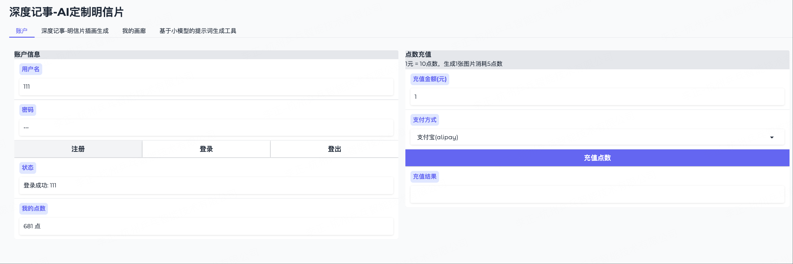
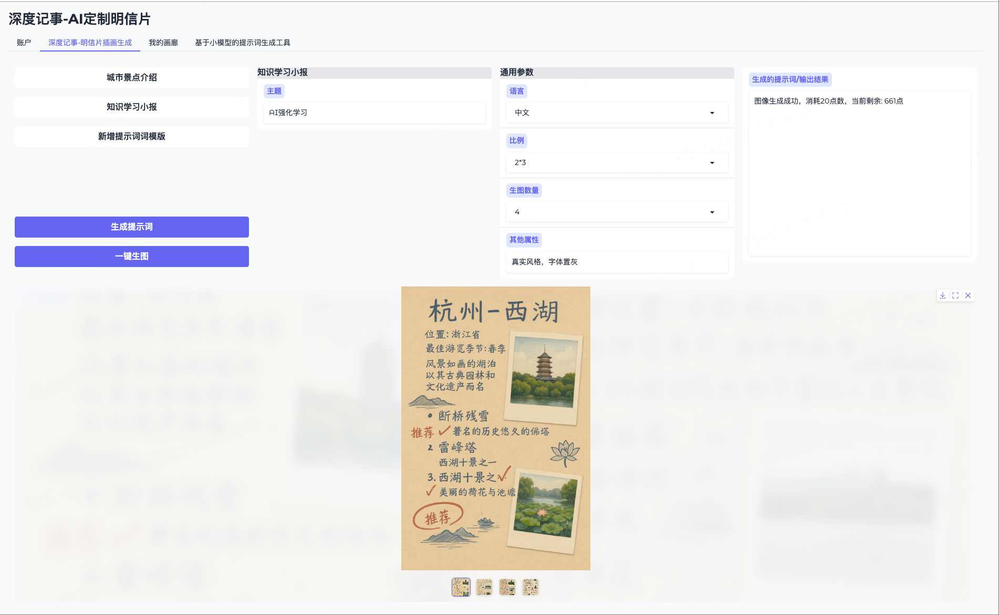
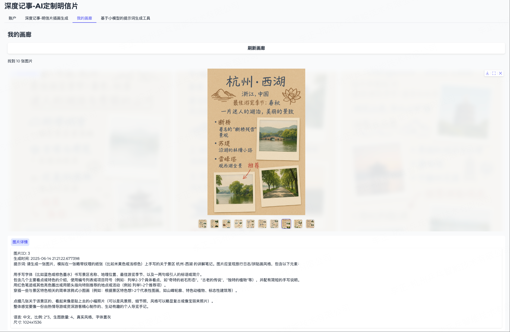
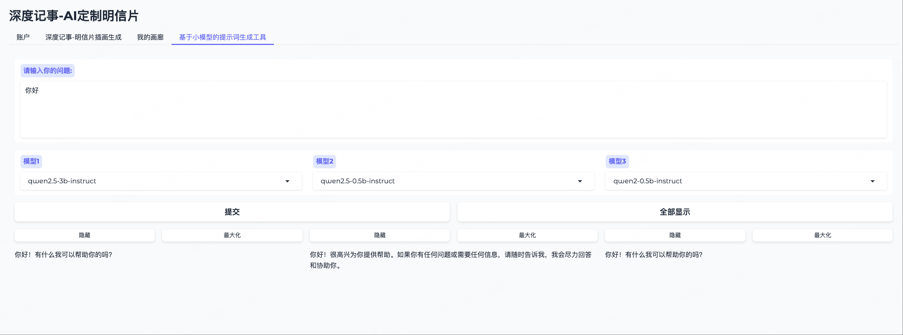

# 深度记事-AI定制明信片

一款基于AI的智能插画生成工具，可根据文本描述自动生成景区介绍、城市介绍、知识卡片等图文内容。

## 线上demo
线上demo地址-https://gpt4o.deepnoting.xyz

## 1、明信片生成小工具

### 1. 模板生成
- **场景模板**
  - 城市/景点描述模板
  - 主题描述模板
- **通用参数设置**
  - 语言选择
  - 输出尺寸
  - 生成图片数量
  - 艺术风格
  - 其他属性配置

### 2. AI内容生成
- 根据选定模板和参数进行AI创作
- 系统自动组合优化提示词
- 输出高质量的图文组合内容

## 2、小模型提示词生成工具

### 多模型对比功能
- **支持多个AI模型同时生成**
  - 可选择2-4个不同的AI模型
  - 支持模型结果并行生成
  - 结果自动分组展示
  
# 如何运行
完善相关config/config.ini文件下的配置参数，然后执行
```bash
python3 main.py即可执行
```

# 执行效果

## 1-登录页面


## 2-明信片生成页面


## 3-画廊页面历史生成图片


## 4-多模型对比效果



